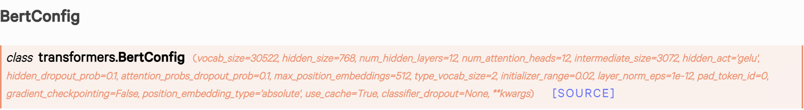
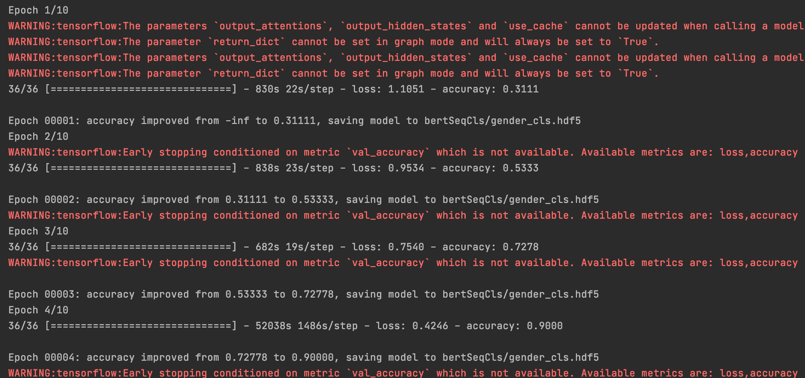

# Movie Comment Cls

## Goal

- 判斷發文者與評論者是否持有相同的觀點
> 主文："他X的~陌生人過馬路都比他好看兩百倍吧!!!!好認真說起還前面的還有一點緊張感但整部片該交代的沒交代清楚所有的故事在一片冗長的折磨當中突然的結束了導演要說甚麼編劇要表達甚麼我想應該是.......他X的again,我完全想不出來。大概是智慧不夠....."
> <br><br>評論：  "有同感,胸悶到爆炸,講不出東西,浪費時間"<br>
> <br> 標籤：1 (支持)

> 主文："先講好的部分,強哥演技很好,令人不寒而慄,白毛的狠勁還有冷靜有展現出來再講我不喜歡的部分.1)整部片子太過平鋪直敘,沒有什麼高低潮.也沒啥爆點.對白毛這人的描述除了狠之外也不夠深入.像是,當電影說""他母親跟兒子死後.他人就變了""我真的看不出來他哪裡變了??在我眼中還是一樣的人.或是.當""FBI介入後,白毛逐漸坐大""我也看不出來哪裡做大了這群人還不是一樣是那幾個人?電影沒有把他的影響力表達出來.在我看來這人除了狠之外.並沒有令人聞風喪膽的壓迫感,就了不起離你遠一點就好好像也不太算黑幫對他對手的描寫也太過簡單.對主角根本沒有威脅到的感覺相對也讓看電影的人看不到FBI培植冬山幫的重要性2)除強哥外,其他演員沒有太過亮眼的表現.整部戲除強尼外,我覺得凱文貝肯以及白毛的老婆算很令人注目的.但他們出場的時間跟重要性都不高如白毛的弟弟,我覺得演員演的真的很好.但你會覺得這角色可有可無以及跟白毛很好的探員.他很重要.但我不清楚這角色在想什麼?他到底是後悔跟白毛狼狽為奸,還是他只想升官然後一群人一起爽他有很多戲分.但感覺沒有深度所以,我只給平雷"
> <br><br>評論："感覺你沒看透徹"
> <br><br> 標籤：0 (反對)

> 主文："很小時侯有看過一部電影,關於戰爭的忘了是國片還是大陸片....故事是這樣的~~~~爸爸被召去打扙...在森林裡,爸爸受了重傷,遇到一條蛇由於太過想念家人,結果戰勝了那條蛇,把它給殺了還喝它的血,吃蛇膽補身體補完身體終於回到家,結果發現兒子為了等爸爸回來爬到樹上等,結果被雷劈死請問有人知道那是什麼片子嘛?謝謝"
> <br><br>評論："聽起來好悲傷"
> <br><br> 標籤：2 (無法判斷)

## Dataset

- PTT 電影版發文與評論(Scrapy)
- 總共標記: 1538筆(反對：60 支持：165 無法判斷：1313)
- Data -> Tokens
> Ex: <br>
> 主文：這部電影很好看<br>
> 評論：推!真的很讚<br>
> input_ids : [101 6857 6956 7442 2512 2523 1962 4692 102 2972 106 4696 4638 2523 6367 102]<br>
> token_type_ids : [0 0 0 0 0 0 0 0 0 1 1 1 1 1 1 1]<br>
> attention_mask：[1 1 1 1 1 1 1 1 1 1 1 1 1 1 1 1]

## TFBertForSequenceClassification
- huggingface : [Bert](https://huggingface.co/transformers/model_doc/bert.html#tfbertforsequenceclassification) <br>
- Chinese Simplified and Traditional, 12-layer, 768-hidden, 12-heads, 110M parameters
- config: Base
```python
from transformers import TFBertForSequenceClassification
model = TFBertForSequenceClassification.from_pretrained('bert-base-chinese', num_labels=3)
```

## Training process


- Save Best Accuracy model
```python
import tensorflow as tf
checkpoint_path = 'bertSeqCls/movie_comment.hdf5'
tf.keras.callbacks.ModelCheckpoint(
            checkpoint_path,
            save_weights_only=True,
            monitor='accuracy',
            mode='max',
            save_best_only=True,
            verbose=1)
```

## Problem
- 資料不足(標記資料無法平衡)
- 訓練時缺少Validation data(無法保存最佳Val_acc的model，可能會有overfit)
